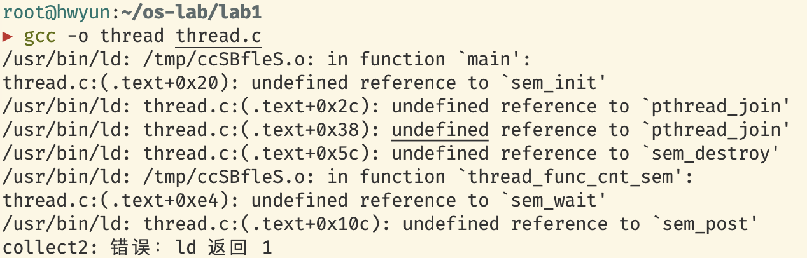
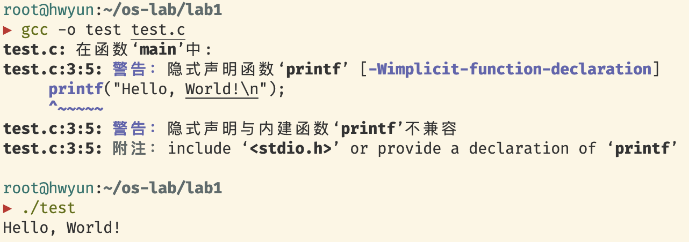
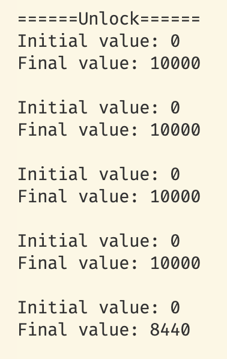
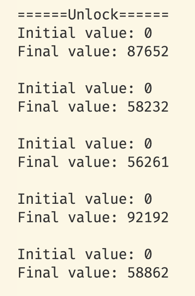

# bugs
## pthread.so

程序中引入了pthread.h头文件并使用了pthread_join、sem_init等函数, gcc直接编译时报错.
这是因为程序只引入了头文件, 即只声明了pthread库的函数, 但是编译器并不知道这些函数的定义, 必须在编译时指定链接选项: -lpthread. 事实上有些库不需要显式指定链接选项, 因为这些库属于libc, 会被编译器自动链接. 对于这类函数, 甚至可以不引入头文件或显式声明函数原型而直接使用, 只要无视编译器的~~无声抗议~~警告:D.

## gettid
pthread_self()并不返回“可读”的tid, 可以使用syscall(SYS_gettid)

## spinlock-unlock
操作规模小时, 现象不明显

## makefile
命令必须TAB开头